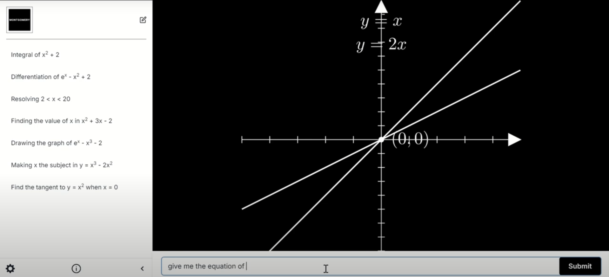

# Project Montgomery
In honor of Ms. Julie Montgomery. A truly admirable AP Calculus teacher from Leland High School who has inspired and taught many of us for multiple years. 

## Inspiration
As math students for most of our lives, we’ve often struggled with not fully understanding a formula or an example problem given by a teacher in class. This can lead to frustration and a feeling of being lost. We wanted to solve this problem by providing students with a more engaging way to visualize math problems and formulas, allowing for a deeper understanding through animated representations.

## What it does
Project Montgomery transforms a simple math problem into an animation video using the Manim library in Python (developed by the famous YouTuber 3Blue1Brown) and Google Gemini to help math students better visualize the problem that they are given. Users can input what to be displayed and be able to see the changes happening to the equations in real time.




Built by Team Recursive Bruins at CalHacks 11.0
- Jonathan Ouyang
- Johnny Zheng
- Justin Osbey
- Eric Zhou

# Installation

1. Clone github repository
    `git clone https://github.com/JonOuyang/CalHacks-Project`

2. Create environment for project using command:
    ```conda env create -f environment.yml```

3. Install required modules for Google Gemini API:
    ```pip install -q -U google-generativeai```

4. Install required modules for rest of project:
    `pip install -r requirements.txt'